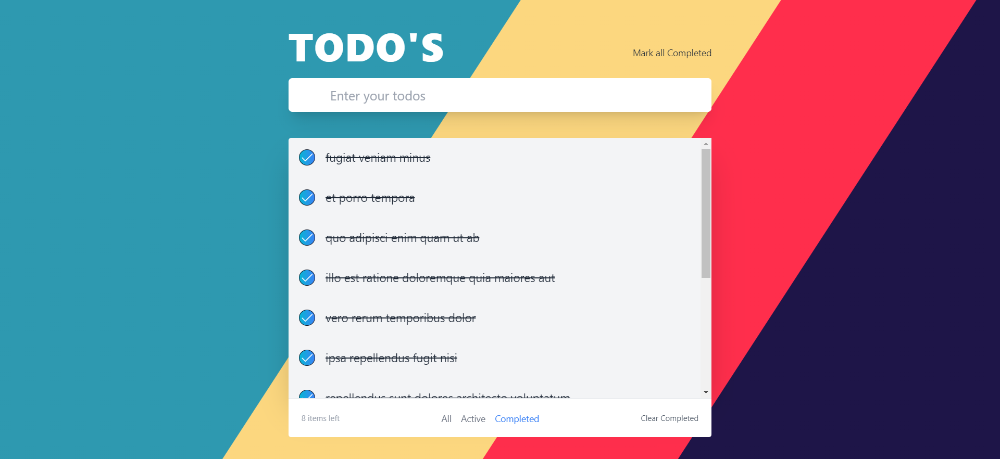

<div align="center">


  <h1 align="center">ToDo React App</h1>

  <p align="center">
    An awesome todo app made by Roy Singh

  </p>
</div>


<!-- ABOUT THE PROJECT -->
## About The Project



A Todo web app is a type of software that allows users to create and manage their daily tasks, reminders, and deadlines in an organized and efficient way.

<p align="right">(<a href="#readme-top">back to top</a>)</p>


### Built With

This section should list any major frameworks/libraries used to bootstrap your project. Leave any add-ons/plugins for the acknowledgements section. Here are a few examples.


* [![React][React.js]][React-url]

* 


<p align="right">(<a href="#readme-top">back to top</a>)</p>


<!-- GETTING STARTED -->
## Getting Started

This is an example of how you may give instructions on setting up your project locally.
To get a local copy up and running follow these simple example steps.

### Prerequisites

This is an example of how to list things you need to use the software and how to install them.
* npm
  ```sh
  npm install npm@latest -g
  ```

### Installation

Below is an example of how to setup and install this app.

1. Clone the repo
   ```sh
   git clone https://github.com/your_username_/Project-Name.git
   ```
2. Install NPM packages
   ```sh
   npm install
   ```
3. For `development Enviornment`
   ```js
   npm run dev
   ```

<p align="right">(<a href="#readme-top">back to top</a>)</p>


<!-- USAGE EXAMPLES -->
## Features

1. Task creation: Users can create a list of tasks with different titles.
2.Task organization: Users can sort tasks based on categories such as active , complete
3.Task deletion: Users can delete/update a task.

<p align="right">(<a href="#readme-top">back to top</a>)</p>


<!-- CONTACT -->
## Contact

Roy Singh - [@your_twitter](https://twitter.com/your_username) - email@example.com

Project Link: [https://github.com/your_username/repo_name](https://github.com/your_username/repo_name)

<p align="right">(<a href="#readme-top">back to top</a>)</p>


 

[Tailwindcss-url]: https://tailwindcss.com/


[React.js]: https://img.shields.io/badge/React-20232A?style=for-the-badge&logo=react&logoColor=61DAFB
[React-url]: https://reactjs.org/
